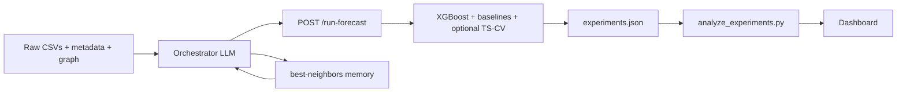

# Final-Year Project Guide — Agentic Forecasting & Experimentation Platform

This document explains **what the system does**, **why key design choices were made**, **how it differs from a typical “predict the stock” project**, and **what to study** to defend it in a master’s viva or final presentation.

---

## 1. What we are doing (in one paragraph)

We built an **agentic experimentation loop** for Indian equity (NIFTY-style universe): an **LLM-backed orchestrator** proposes **cross-stock neighbor sets** (which other tickers might help predict a target), a **FastAPI forecast service** trains an **XGBoost regressor** on **calendar-aligned daily returns** and scores each proposal with **MAE on a time-ordered holdout**, and results are **logged** (`experiments.json`) and **aggregated** into a **web dashboard** (`analysis.json`). The goal is not only a point forecast but a **repeatable research pipeline**: propose → measure → remember → refine.

---

## 2. End-to-end architecture (mental model)




- **Data layer:** `services/data/raw/*.csv`, `metadata/metadata.json`, `stock_graph.json`.
- **Brain (search):** Nitro/H3 APIs under `apps/orchestrator/server/api/` call Gemini with structured output (Zod schemas).
- **Muscle (scoring):** `services/forecast_engines/main.py` — training, evaluation, logging.
- **Memory:** `experiments.json` + `GET /best-neighbors/{symbol}?horizon=…`.
- **Reporting:** `scripts/analyze_experiments.py` → `analysis.json` → `apps/dashboard/index.html`.

---

## 3. Why these choices?

### 3.1 Returns instead of raw prices

**Choice:** Model **daily returns** r_t = (P_t - P_{t-1})/P_{t-1}, not level prices.

**Why:** Prices are **non-stationary** (trend, regime shifts). Returns are closer to a stationary target and are standard in quantitative workflows. The dashboard expresses MAE in **percent** space for interpretability.

---

### 3.2 Calendar alignment (`merge` on `Date`)

**Choice:** Combine target and each neighbor with an **inner join on trading date**, not row position.

**Why:** Different symbols can have **different calendars** (missing rows, history length). Row-i alignment silently pairs **wrong days** and invalidates MAE comparisons between neighbor sets.

**Snippet (Python):**

```86:101:services/forecast_engines/main.py
def build_dataset(
    target: str, neighbors: list[str], horizon: int
) -> tuple[pd.DataFrame, pd.Series, list[str], pd.Series]:
    target_df = load_returns(target).rename(columns={"return": "target_return"})
    merged = target_df
    valid_neighbors: list[str] = []

    for neighbor in neighbors:
        if neighbor == target:
            continue
        if not symbol_exists(neighbor):
            print(f"Skipping {neighbor} (not in dataset)")
            continue
        ndf = load_returns(neighbor).rename(columns={"return": f"{neighbor}_return"})
        merged = merged.merge(ndf, on="Date", how="inner")
        valid_neighbors.append(neighbor)
```

---

### 3.3 XGBoost as the scorer (not the “star of the show”)

**Choice:** **XGBRegressor** with a simple tabular feature block (lags, rolling stats, neighbor lag-1).

**Why:**

- **Fast** enough to call many times from an agent loop.
- **Strong baseline** for structured features without heavy deep-learning ops.
- Keeps the **thesis story** on **experiment design and neighbor discovery**, not on squeezing 0.01% from an LSTM.

The model is the **measuring instrument**; the **agent** is the **hypothesis generator**.

---

### 3.4 Naive baselines and `mae_for_ranking`

**Choice:** On the **test split**, compute MAE of predicting **always zero** (and train-mean). Define **`beats_baseline_zero`**. If the model does **not** beat zero, add a **penalty** to the ranking score so the orchestrator does not treat “almost as bad as trivial” as a win.

**Why:** In noisy return forecasting, **low absolute MAE** can still be **worse than predicting zero**. Without baselines, you cannot claim “the agent found a better configuration.”

**Snippet:**

```215:234:services/forecast_engines/main.py
    mae_baseline_zero = float(mean_absolute_error(y_test, np.zeros(len(y_test))))
    train_mean = float(y_train.mean())
    mae_baseline_mean = float(
        mean_absolute_error(y_test, np.full(len(y_test), train_mean))
    )
    ...
    mae = float(mean_absolute_error(y_test, preds))
    beats_baseline_zero = mae < mae_baseline_zero
    mae_for_ranking = mae if beats_baseline_zero else mae + BASELINE_RANKING_PENALTY
```

**Honest result in your current runs:** many calibrated experiments show **`beats_baseline_zero: false`**. That is a **valid scientific outcome** for a master’s project if you **report it** and discuss **why** (noise, horizon, feature set, regime).

---

### 3.5 LLM for **neighbor proposals**, not for **numeric oracle**

**Choice:** Gemini (via AI SDK) outputs **structured JSON** (neighbor lists + rationale). Python trains and scores.

**Why:**

- LLMs are good at **combining metadata, graph hints, and natural-language priors** into **diverse hypotheses**.
- They are **not** reliable as standalone price engines without strict grounding; here they **propose**, the **market data + XGB** **disprove or support**.

**Snippet (orchestrator calls forecast with traceability):**

```12:29:apps/orchestrator/server/api/experiment-multiple.post.ts
async function runForecast(
  target: string,
  neighbors: string[],
  horizon: number,
  meta: { experiment_id: string; rationale: string; orchestrator_round: number }
) {
  return await $fetch(`${FASTAPI}/run-forecast`, {
    method: "POST",
    body: {
      target,
      neighbors,
      horizon,
      source: "experiment-multiple",
      experiment_id: meta.experiment_id,
      rationale: meta.rationale,
      orchestrator_round: meta.orchestrator_round
    }
  })
}
```

---

### 3.6 Multi-round agent loop (explore → refine → mutate)

**Choice:** `experiment-multiple.post.ts` runs **three rounds** of proposals, feeding **best-so-far** and **past experiments** back into prompts.

**Why:** Mimics a **human quant researcher**: broad search, then local improvement, then **deliberate diversity** (mutation) to avoid getting stuck in one sector story.

---

### 3.7 Experiment log + analysis + dashboard

**Choice:** Append-only **JSON** log with optional **file lock**, batch **analysis** script, static **dashboard** fed by `analysis.json`.

**Why:**

- **Reproducibility:** you can show *what* was tried, *when*, and *under which horizon*.
- **Separation of concerns:** API stays fast; heavy charts are **precomputed**.
- **Presentation:** professors and panels understand **graphs**; show **calibrated vs legacy** honestly (your dashboard includes a methodology banner and calibrated leaderboard).

---

## 3.8 Do we “outperform normal XGBRegressor”? Where we excel. Why choose this approach?

### 3.8.1 What “normal XGBRegressor” even means

Inside `services/forecast_engines/main.py` the scorer **is** a standard **`XGBRegressor`** (same library, same booster family anyone else would use). So the project does **not** claim a *new algorithm* that beats XGBoost.

A fair question is instead:

> *Given the **same** training procedure and metric, does **agent-chosen neighbor context** beat **hand-picked or default neighbor context**?*

That is a comparison of **feature design / hypothesis search**, not of “our XGB vs sklearn’s XGB.”

### 3.8.2 Do we outperform?

**On your current calibrated logs:** many runs **do not** beat a **zero-return** baseline on the holdout (`beats_baseline_zero` is often false). So you should **not** tell the panel that the system “outperforms standard ML” in the sense of **forecasting skill**.

What you *can* say truthfully:

- The pipeline can **outperform ignorance of calendar alignment** (row-aligned joins were wrong; date merge is the correct panel construction).
- The pipeline can **outperform an unstructured workflow** (no logging, no baselines, no memory) in terms of **research rigor and repeatability** — that is a **process** win, not a guaranteed **MAE** win.

If you need a numeric A/B for the thesis, the repo implements it explicitly:

| Variant | What changes |
|--------|----------------|
| **Baseline A** | Same `XGBRegressor`, **no** neighbor columns (only target lags + rolls). |
| **Baseline B** | Same model, **fixed** neighbors (top-3 **correlation** from `metadata.json`). |
| **Ours** | Same model, **best logged agent** neighbor set for that target/horizon (by **`mae_for_ranking`** in `experiments.json`). |

- **Script:** `compare_baselines.py` builds the same 80/20 chronological split for all three arms and writes `baseline_comparison.json`.
- **Dashboard:** `analyze_experiments.py` computes **`baseline_comparison`** (per-target table + win counts) which is rendered in the **”Baseline A vs B vs Ours”** section. The UI shows win counts, per-target MAE, and beats-zero status.

Then report **holdout MAE** (and **whether each beats zero**) on the **same** date range. “Our approach is better” must match these numbers, not hand-waving.

### 3.8.3 Where this work **excels** (defensible claims)

Use this language in the report or viva:

1. **Hypothesis space coverage** — An LLM + graph + metadata can propose **many diverse neighbor sets** faster than manual trial-and-error; XGB is the **constant yardstick** used to compare those hypotheses.
2. **Measurement hygiene** — Calendar **`Date` merge**, chronological split, **explicit naive baselines**, optional **time-series CV**, and **transparent logging** (horizon, dates, rationale, source) are **stronger engineering** than most student forecasting demos.
3. **Institutional memory** — `experiments.json` and **`/best-neighbors`** close the loop so later runs are **informed** by earlier scores (explore → refine → mutate).
4. **Honest reporting** — The dashboard can show **calibrated vs legacy** and **% beating zero**; presenting a **negative result** clearly is academically **better** than overstating accuracy.

### 3.8.4 Why choose **this** approach (thesis narrative)

| Reason | Explanation |
|--------|-------------|
| **Problem fit** | The interesting question is often *which cross-asset signals matter*, not only *which scalar MAE a single fixed model gets*. |
| **Same scorer, fair comparisons** | Keeping **XGBRegressor** fixed isolates the effect of **neighbor discovery** and **evaluation** rather than conflating it with arbitrary architecture changes. |
| **Speed & clarity** | Boosting on tabular lags is **fast** in a loop; results are **easier to explain** than an opaque sequence model in a viva. |
| **Extensibility** | You can swap the scorer (different model), enrich features, or tighten the agent — the **architecture** stays: *propose → score → log → visualize*. |
| **Ethical / scientific stance** | Baselines and **`mae_for_ranking`** force the system to **not celebrate** configs that lose to trivial predictors — that is how real quant research **should** behave. |

**One sentence for the examiner:** *We did not replace XGBoost; we built an **agentic layer** around it to **search and evaluate cross-stock feature hypotheses** with **proper time-series discipline** — and we report when the model **fails** to beat simple baselines.*

---

## 4. Where this work **excels** (vs a typical “LSTM predicts stock” MCA project)

Be precise in the viva: these are **engineering and research-process** strengths, not a claim of trading alpha.


| Dimension       | Typical student project      | This project                                                                       |
| --------------- | ---------------------------- | ---------------------------------------------------------------------------------- |
| Problem framing | Single model, fixed features | **Agent proposes features** (neighbors), system **evaluates**                      |
| Data hygiene    | Often silent alignment bugs  | **Explicit `Date` merge**                                                          |
| Evaluation      | One accuracy number          | **Time split + baselines + optional time-series CV**                               |
| Memory          | None                         | **`experiments.json` + best-neighbors API**                                       |
| Transparency    | Black box                    | **Logged rationale, source, horizon** (orchestrator integration)                   |
| Honesty         | Overclaim                    | Dashboard can show **0% beat zero baseline** — defensible if interpreted correctly |


---

## 5. Why we **accept** being “like this” in code (tradeoffs)

- **Stateless retrain per request:** Simpler, always consistent with **current** CSVs and neighbor list; cost is CPU time (mitigated with `FORECAST_ENGINES_SKIP_CV` for bulk runs).
- **Small neighbor cardinality (≤3 in multi-round flow):** Controls dimensionality and avoids unstable wide panels.
- **Single main holdout split in API:** Easy to explain; time-series CV is **optional** signal, not the only metric.
- **Mixed legacy + new experiments in history:** Preserved for continuity; analysis distinguishes **calibrated** rows where possible.

---

## 6. Things you should **learn** to present and defend (master’s checklist)

Use this as a **study syllabus** before the final presentation or viva.

### 6.1 Time series fundamentals

- **Stationarity** (why returns vs prices).
- **Leakage:** what must never enter the feature set from the future (your `future_return` is only the **target**, features are lagged — be ready to draw a timeline on the board).
- **Train/test split along time** vs random split (why random split is wrong here).

### 6.2 Baselines and “is it any good?”

- **Zero forecast**, **mean forecast**, maybe **persistence** (last return) on the **same** test window.
- **Diebold–Mariano** or at least **“is beat rate significantly > 50%?”** — know the limits of **hit-rate** without variance estimates.

### 6.3 Tree **models and XGBoost (at interview depth)**

- What boosting minimizes; **bias–variance** intuition; role of `**max_depth`**, `**learning_rate**`, `**n_estimators**`.
- Why **MAE** on **returns** is a **noisy** metric — link to your **smooth pred vs spiky actual** plots.

### 6.4 Agentic systems and LLM limits

- **Structured outputs** (Zod / JSON schema) and **why** you still validate tickers in Python.
- **Grounding:** LLM proposes; **data + model** score — avoid claiming the LLM “knows” future prices.
- **Cost and rate limits** when running full sweeps (`run_full_experiment.py`).

### 6.5 Software architecture

- **REST APIs** (FastAPI): request/response contracts, `horizon`, optional metadata fields.
- **Idempotency / concurrency** — why experiment logging uses a **lock**.
- **Batch analytics** vs **online** serving (analyze script vs dashboard).

### 6.6 Visualization literacy

- How to read **MAE distribution** and **backtest** plots.
- **Dual leaderboard** story: **legacy** vs **calibrated** — why mixing them without explanation misleads.

### 6.7 Academic framing (one slide you should own)

- **Hypothesis:** cross-sectional neighbors contain information for **multi-day** forward returns.
- **Method:** agent-generated neighbor sets, XGB, chronological evaluation, baselines.
- **Result:** *currently* weak vs zero baseline on many runs — **honest limitation** + **future work** (features, regimes, walk-forward, transaction costs).

---

## 7. Suggested “elevator pitch” (30 seconds)

> We built an agentic pipeline that searches **which other stocks** help predict a target’s **forward return**, using **metadata and a similarity graph** to propose experiments, **XGBoost** to score them on a **time-based holdout**, and **explicit baselines** so we don’t confuse noise with skill. Everything is **logged** and **visualized**. The interesting scientific result so far is that **beating a zero baseline is hard** — which is exactly why the **evaluation design** matters more than a single flashy accuracy number.

---

## 8. File map (quick reference)


| Path                                                       | Role                                                           |
| ---------------------------------------------------------- | -------------------------------------------------------------- |
| `services/forecast_engines/main.py`                        | Data load, `build_dataset`, `/run-forecast`, `/best-neighbors` |
| `services/forecast_engines/experiment_logger.py`           | Locked append to `experiments.json`                            |
| `apps/orchestrator/server/api/experiment-multiple.post.ts` | Multi-round LLM + scoring                                      |
| `apps/orchestrator/server/api/experiment-agent.post.ts`    | Single-round agent experiments                                 |
| `services/forecast_engines/scripts/analyze_experiments.py` | Builds `analysis.json`, calibrated leaderboard                 |
| `apps/dashboard/index.html`                                | Static dashboard                                               |
| `apps/dashboard/serve.py`                                  | Regenerate/sync/serve                                          |


---

For **what to say in the viva**, **slide outlines**, and **Q&A**, see **`docs/PRESENTATION_AND_DEFENSE.md`**.

*This guide is meant for your master’s defense narrative: **process, rigor, and honest results** beat overclaiming predictive power.*